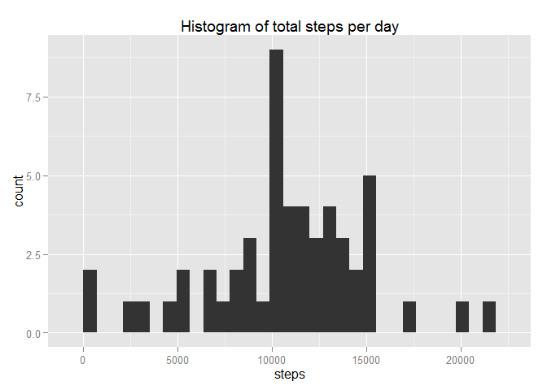
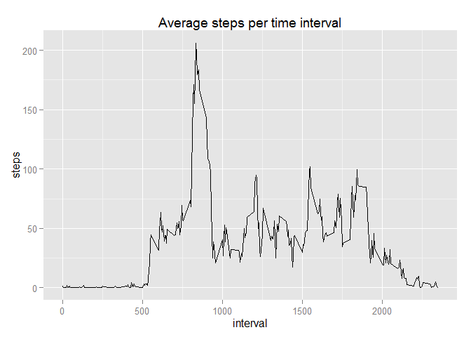
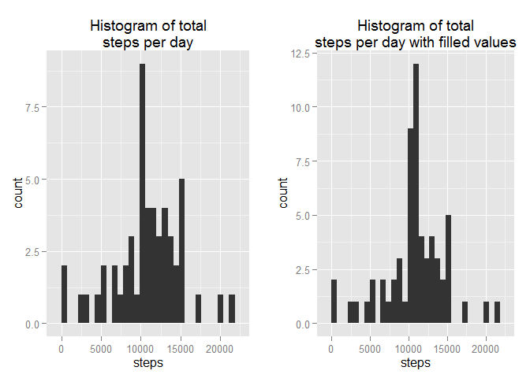
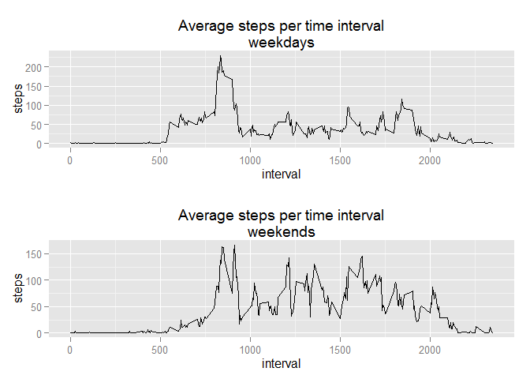

# Reproducible Research: Peer Assessment 1
Created by Anastasios Mallis

The r code in this R Markdown file works only if the working directory is teh directory of the repository.


```r
# installing required packages
#install.packages("utils")
#install.packages("plyr")
#install.packages("ggplot2")
#install.packages("gridExtra")
```
####Loading and preprocessing the data

```r
# unzip the file 
library("utils")
unzip("activity.zip","activity.csv")

# 1. read the data from the file
data <- read.csv("activity.csv", header=TRUE)

# 2. keep only the clean data
cleanData <- data[complete.cases(data),]
```

####What is mean total number of steps taken per day?

```r
library("plyr")

# 1. calculating the sum per day
totalPerDay <- ddply(cleanData, "date", numcolwise(sum))[,1:2]

# 2. plotting a histogram of the total number of steps taken per day
library("ggplot2")
qplot(steps, data=totalPerDay, geom="histogram")+
  ggtitle("Histogram of total steps per day")
```

 

```r
# 3. calculating the mean and the median of the total number of steps taken per day
meanSteps   <-  round(mean(totalPerDay[,2]),3);    meanSteps
```

```
## [1] 10766.19
```

```r
medianSteps <-  median(totalPerDay[,2]);  medianSteps
```

```
## [1] 10765
```
The mean of the total number of steps taken per day is 1.0766189\times 10^{4}.
The median of the total number of steps taken per day is 10765.


####What is the average daily activity pattern?

```r
# 1. ploting time series of the 5-minute interval (x-axis) and the average number of steps taken, averaged across all days (y-axis)
stepsPerInterval <- ddply(cleanData, "interval", numcolwise(mean))[,1:2]
ggplot() + geom_line(data=stepsPerInterval, aes(x=interval, y=steps))+
  ggtitle("Average steps per time interval")
```

 

```r
# 2. finding the 5-minute interval, on average across all the days in the dataset, that contains the maximum number of steps
maxStepsInterval <- stepsPerInterval[stepsPerInterval[,2]==max(stepsPerInterval[,2]),1]
maxStepsInterval
```

```
## [1] 835
```
On average the most number of steps happens at the time interval 835.


####Imputing missing values

```r
# 1. calculating and reporting the number of missing values
numMissingValues <- length(which(is.na(data)))
numMissingValues
```

```
## [1] 2304
```
The number of missing values is 2304.


```r
# 2. filling the NAs with the mean for that 5-minute interval
for (i in 1:length(data[,1])){
  if(is.na(data[i,1])){
    data[i,1] <- stepsPerInterval[data[i,3]==stepsPerInterval[,1],2]
  }
}

# 3. "data" now is a dataset that is equal to the original dataset but with the missing data filled in

# 4. Making a histogram of the total number of steps taken each day and Calculating and reporting the mean and median total number of steps taken per day.

# calculating the sum per day
totalPerDay_filled <- ddply(data, "date", numcolwise(sum))[,1:2]

# plotting a histogram of the total number of steps taken per day (with ad with out filled data)
library("gridExtra")
```

```
## Loading required package: grid
```

```r
plot1 <- qplot(steps, data=totalPerDay, geom="histogram")+
  ggtitle("Histogram of total\nsteps per day")
plot2 <- qplot(steps, data=totalPerDay_filled, geom="histogram")+
  ggtitle("Histogram of total\nsteps per day with filled values")
grid.arrange(plot1, plot2, ncol=2)
```

 

```r
# Calculating and reporting the mean and median total number of steps taken per day
meanSteps_filled   <-  round(mean(totalPerDay_filled[,2]),3);    meanSteps_filled
```

```
## [1] 10766.19
```

```r
medianSteps_filled <-  median(totalPerDay_filled[,2]);  medianSteps_filled
```

```
## [1] 10766.19
```
The mean of the total number of steps taken per day is 1.0766189\times 10^{4} (filling the NAs).
The median of the total number of steps taken per day is 1.0766189\times 10^{4} (filling the NAs).

```r
# impact of imputing missing data on the estimates of the total daily number of steps
diff_mean   <- meanSteps_filled   - meanSteps;    diff_mean 
```

```
## [1] 0
```

```r
diff_median <- medianSteps_filled - medianSteps;  diff_median
```

```
## [1] 1.188679
```
The mean of the total number of steps taken per day changed by 0 when filling the NAs.
The median of the total number of steps taken per day changed by 1.1886792 when filling the NAs.


####Are there differences in activity patterns between weekdays and weekends?


```r
# 1. Creating a new factor variable in the dataset with two levels - "weekday" and "weekend" indicating whether a given date is a weekday or weekend day
day<-factor(weekdays(as.Date(data$date)))
daytype<-c(rep("",length(day)))
for (i in 1:length(day)){
  if (day[i]=="Saturday"| day[i] =="Sunday"){
    daytype[i]<- "weekend"
  }else{
    daytype[i]<- "weekday"
  }
}

data <- cbind(data, daytype)
# 2. Making a panel plot containing a time series plot (i.e. type = "l") of the 5-minute interval (x-axis) and the average number of steps taken, averaged across all weekday days or weekend days (y-axis).
steps_per_interval_per_daytype<-ddply(data, c("interval","daytype") , numcolwise(mean))

plot3 <- ggplot() + geom_line(data=steps_per_interval_per_daytype[steps_per_interval_per_daytype$daytype=="weekday",], aes(x=interval, y=steps))+
  ggtitle("Average steps per time interval\nweekdays")

plot4 <- ggplot() + geom_line(data=steps_per_interval_per_daytype[steps_per_interval_per_daytype$daytype=="weekend",], aes(x=interval, y=steps))+
  ggtitle("Average steps per time interval\nweekends")

grid.arrange(plot3, plot4, nrow=2)
```

 
